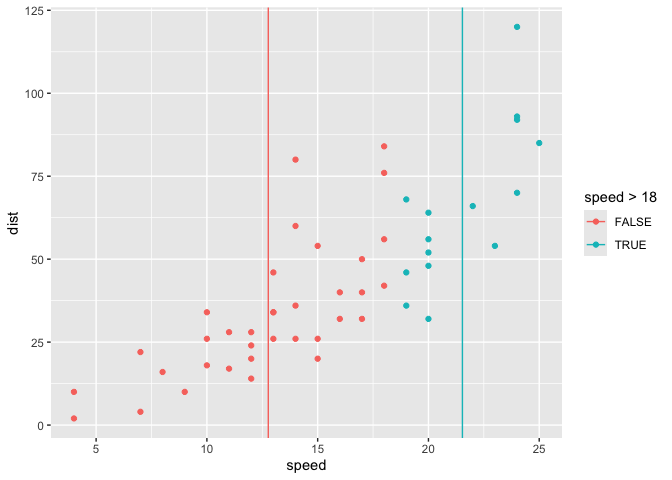
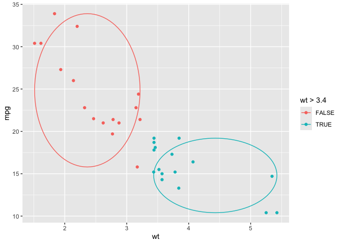
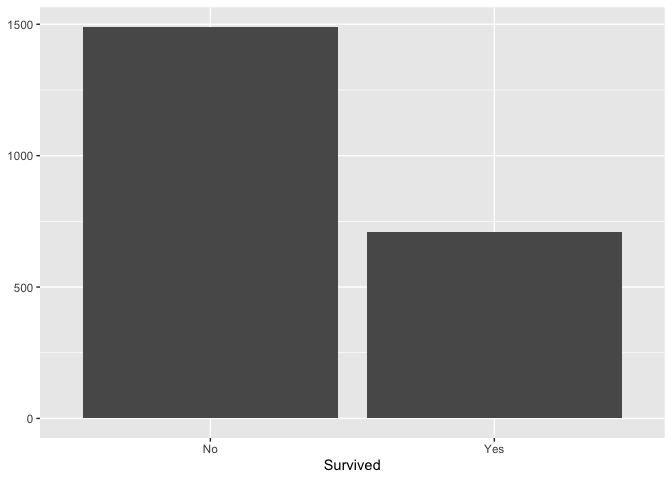

  - [Part I. Work out functionality ✅](#part-i-work-out-functionality-)
      - [Intro Thoughts](#intro-thoughts)
      - [Status Quo: 1. compute, 2. ggproto, 3. define
        layer](#status-quo-1-compute-2-ggproto-3-define-layer)
      - [Experimental: `define_layer_temp()` combines 2 and 3 in using a
        temp
        stat](#experimental-define_layer_temp-combines-2-and-3-in-using-a-temp-stat)
          - [Try it out](#try-it-out)
          - [Can you define a second w/ the same
            StatTemp…](#can-you-define-a-second-w-the-same-stattemp)
      - [And `create_layer_temp` method, even more experimental (but
        feeling nicer to
        use)](#and-create_layer_temp-method-even-more-experimental-but-feeling-nicer-to-use)
          - [First just checking out how assign
            works.](#first-just-checking-out-how-assign-works)
          - [wrapping this…](#wrapping-this)
      - [Let’s do star example\!](#lets-do-star-example)
          - [a real-world example… :-)](#a-real-world-example--)
  - [geom\_xmean on the fly with compute
    group…](#geom_xmean-on-the-fly-with-compute-group)
      - [compute\_oval\_minmax](#compute_oval_minmax)
  - [spatial ‘status quo’ of ggplot2 extension
    cookbook](#spatial-status-quo-of-ggplot2-extension-cookbook)
  - [define\_layer\_sf\_temp build](#define_layer_sf_temp-build)
  - [Part II. Packaging and documentation 🚧
    ✅](#part-ii-packaging-and-documentation--)
      - [Phase 1. Minimal working
        package](#phase-1-minimal-working-package)
          - [Bit A. Created files for package archetecture, running
            `devtools::create(".")` in interactive session. 🚧
            ✅](#bit-a-created-files-for-package-archetecture-running-devtoolscreate-in-interactive-session--)
          - [Bit B. Added roxygen skeleton? 🚧
            ✅](#bit-b-added-roxygen-skeleton--)
          - [Bit C. Managed dependencies ? 🚧
            ✅](#bit-c-managed-dependencies---)
          - [Bit D. Moved functions R folder? 🚧
            ✅](#bit-d-moved-functions-r-folder--)
          - [Bit E. Run `devtools::check()` and addressed errors. 🚧
            ✅](#bit-e-run-devtoolscheck-and-addressed-errors--)
          - [Bit F. Build package 🚧 ✅](#bit-f-build-package--)
          - [Bit G. Write and test traditional README that uses built
            package. 🚧
            ✅](#bit-g-write-and-test-traditional-readme-that-uses-built-package--)
          - [Bit H. Chosen a license? 🚧 ✅](#bit-h-chosen-a-license--)
          - [Bit I. Add lifecycle badge
            (experimental)](#bit-i-add-lifecycle-badge-experimental)
      - [Phase 2: Listen & iterate 🚧 ✅](#phase-2-listen--iterate--)
      - [Phase 3: Let things settle](#phase-3-let-things-settle)
          - [Bit A. Settle on examples. Put them in the roxygen skeleton
            and readme. 🚧
            ✅](#bit-a-settle-on-examples-put-them-in-the-roxygen-skeleton-and-readme--)
          - [Bit B. Written formal tests of functions and save to test
            that folders 🚧
            ✅](#bit-b-written-formal-tests-of-functions-and-save-to-test-that-folders--)
          - [Bit C. Added a description and author information in the
            DESCRIPTION file 🚧
            ✅](#bit-c-added-a-description-and-author-information-in-the-description-file--)
          - [Bit D. Addressed *all* notes, warnings and errors. 🚧
            ✅](#bit-d-addressed-all-notes-warnings-and-errors--)
      - [Phase 4. Promote to wider
        audience…](#phase-4-promote-to-wider-audience)
          - [Bit A. Package website built? 🚧
            ✅](#bit-a-package-website-built--)
          - [Bit B. Package website deployed? 🚧
            ✅](#bit-b-package-website-deployed--)
      - [Phase 5: Harden/commit](#phase-5-hardencommit)
          - [Submit to CRAN? 🚧 ✅](#submit-to-cran--)
  - [Appendix: Reports, Environment](#appendix-reports-environment)
      - [Description file extract](#description-file-extract)
      - [Environment](#environment)
      - [`devtools::check()` report](#devtoolscheck-report)
      - [Non-developer introduction to package (and test of installed
        package)](#non-developer-introduction-to-package-and-test-of-installed-package)
      - [Example using package](#example-using-package)

Proposing the {ggtemp} package\! 🦄
<!-- (typical package introduction write up; but actually aspirational) -->

The goal of {ggtemp} is to make writing some quick useful extension
functions succinct. Right now, the amount of code required to write
extensions is a bit of a mouthful, and could feel prohibitive for
day-to-day analysis. Specifically, defining new geom\_\* and stat\_\*
layers outside of the context of a package, I believe, is not common,
but could be quite useful, ultimately making plot builds intiuitive,
fun, and readable. However the usual amount of code required to make
define new geom\_\* or stat\_\* functions, might feel like it ‘gunks up’
your script.

With the {ggtemp} package, we’ll live in a different world (🦄 🦄 🦄) where
the task is a snap 🫰, and the readability of the in-script definition of
a geom\_\* or stat\_\* function is quite succinct:

Proposed API where we create a new geom\_\* layer function

    library(ggtemp)
    
    # 1. work out some compute
    compute_group_xmean <- function(data, scales){
      
      data |> # a dataframe with vars x, the required aesthetic
        summarize(x = mean(x)) |>
        mutate(xend = x) |>
        mutate(y = -Inf, yend = Inf)
    
    }
    
    # 2. create layer function based on compute geom_xmean)
    create_layer_temp(fun_name = "geom_xmean",
                      compute_group = compute_group_xmean,
                      required_aes = "x",
                      geom = "segment")
                      
                      
    # 3. Use temp layer!                   
    ggplot(data = cars) + 
      aes(x = speed, y = dist) + 
      geom_point() + 
      geom_xmean()

# Part I. Work out functionality ✅

## Intro Thoughts

What if you just want to define a basic computational engine (geom\_\*
or stat\_\* function) on the fly in a script. It seems like it requires
a good amount of code, but there are things that repeat. Below, we see
if we define a StatTemp within a function, and use that function to
remove some of the repetition for vanilla-y extensions.

TLDR: This seems to work, and surprisingly well (??). I thought I’d only
be able to use StatTemp once, but you seem to be able to define multiple
geoms\_\* functions with the same define\_temp\_geom wrapper…

## Status Quo: 1. compute, 2. ggproto, 3. define layer

``` r
library(tidyverse)
#> ── Attaching core tidyverse packages ─────────────────── tidyverse 2.0.0.9000 ──
#> ✔ dplyr     1.1.0          ✔ readr     2.1.4     
#> ✔ forcats   1.0.0          ✔ stringr   1.5.0     
#> ✔ ggplot2   3.4.4.9000     ✔ tibble    3.2.1     
#> ✔ lubridate 1.9.2          ✔ tidyr     1.3.0     
#> ✔ purrr     1.0.1          
#> ── Conflicts ────────────────────────────────────────── tidyverse_conflicts() ──
#> ✖ dplyr::filter() masks stats::filter()
#> ✖ dplyr::lag()    masks stats::lag()
#> ℹ Use the conflicted package (<http://conflicted.r-lib.org/>) to force all conflicts to become errors
compute_panel_equilateral <- function(data, scales, n = 15){
  
  data |> 
    mutate(group = row_number()) |> 
    crossing(tibble(z = 0:n)) |>
    mutate(around = 2*pi*z/max(z)) |> 
    mutate(x = x0 + cos(around)*r,
           y = y0 + sin(around)*r) 
  
}

StatCircle <- ggproto(
  `_class` = "StatCircle",
  `_inherit` = ggplot2::Stat,
  compute_panel = compute_panel_equilateral,
  required_aes = c("x0", "y0", "r"))

geom_circle <- function(
  mapping = NULL,
  data = NULL,
  position = "identity",
  na.rm = FALSE,
  show.legend = NA,
  inherit.aes = TRUE, ...) {
  ggplot2::layer(
    stat = StatCircle,  # proto object from Step 2
    geom = ggplot2::GeomPolygon,  # inherit other behavior
    data = data,
    mapping = mapping,
    position = position,
    show.legend = show.legend,
    inherit.aes = inherit.aes,
    params = list(na.rm = na.rm, ...)
  )
}

data.frame(x0 = 0:1, y0 = 0:1, r = 1:2/3) |> 
  ggplot() + 
  aes(x0 = x0, y0 = y0, r = r) + 
  geom_circle() + 
  aes(fill = r)
```

<!-- -->

## Experimental: `define_layer_temp()` combines 2 and 3 in using a temp stat

``` r
define_layer_temp <- function(
  required_aes,
  compute_panel = NULL, 
  compute_group = NULL,
  geom = NULL,
  geom_default = ggplot2::GeomPoint, 
  mapping = NULL,
  data = NULL,
  position = "identity",
  na.rm = FALSE,
  show.legend = NA,
  inherit.aes = TRUE, 
  ...) {

  if(!is.null(compute_panel)){
StatTemp <- ggproto(
  `_class` = "StatTemp",
  `_inherit` = ggplot2::Stat,
  compute_panel = compute_panel,
  required_aes = required_aes)
  }
  
  if(!is.null(compute_group)){
StatTemp <- ggproto(
  `_class` = "StatTemp",
  `_inherit` = ggplot2::Stat,
  compute_group = compute_group,
  required_aes = required_aes)
  }  
  
  if(is.null(geom)){geom <- geom_default}

  ggplot2::layer(
    stat = StatTemp,  # proto object from Step 2
    geom = geom,  # inherit other behavior
    data = data,
    mapping = mapping,
    position = position,
    show.legend = show.legend,
    inherit.aes = inherit.aes,
    params = list(na.rm = na.rm, ...)
  )
}
```

### Try it out

#### abbreviated definition `geom_circle()` using `define_layer_temp`

``` r
compute_panel_circle <- function(data, scales, n = 15){
  
  data |> 
    mutate(group = row_number()) |> 
    crossing(tibble(z = 0:n)) |>
    mutate(around = 2*pi*z/max(z)) |> 
    mutate(x = x0 + cos(around)*r,
           y = y0 + sin(around)*r) 
  
}

geom_circle <- function(...){
  
  define_layer_temp(
    required_aes = c("x0", "y0", "r"),
    compute_panel = compute_panel_circle,
    geom_default = ggplot2::GeomPath,
    ...)
  
}
```

#### use `geom_circle()`

We see that the layers that are created can always have there geom
switched (provided that required aes are computed in the background).

``` r
library(ggplot2)
data.frame(x0 = 0:1, y0 = 0:1, r = 1:2/3) |>
  ggplot() +
  aes(x0 = x0, y0 = y0, r = r) +
  geom_circle() +
  aes(fill = r)
```

<!-- -->

``` r

last_plot() + 
  geom_circle(geom = "point")
```

<!-- -->

### Can you define a second w/ the same StatTemp…

#### define geom\_heart

``` r
compute_panel_heart <- function(data, scales){

  data %>%
  mutate(group = row_number()) %>%
  tidyr::crossing(around = 0:15/15) %>%
    dplyr::mutate(
      y = y0 + r * (
        .85 * cos(2*pi*around)
        - .35 * cos(2 * 2*pi*around)
        - .25 * cos(3 * 2*pi*around)
        - .05 * cos(4 * 2*pi*around)
      ),
      x = x0 + r * (sin(2*pi*around)^3))

}

geom_heart <- function(...){

    define_layer_temp(
      required_aes = c("x0", "y0", "r"),
      compute_panel = compute_panel_heart,
      geom_default =ggplot2::GeomPolygon,
      ...)

  }
```

#### try using both geom\_heart and geom\_circle together…

``` r
data.frame(x0 = 0:1, y0 = 0:1, r = 1:2/3) |>
  ggplot() +
  aes(x0 = x0, y0 = y0, r = r) +
  geom_heart(alpha = .3) +
  geom_circle(color = "red", 
              data = data.frame(x0 = 4,y0 = 2, r = 1)) + 
  annotate(geom = "point", x = .5, y = .5, size = 8, color = "green")
```

<!-- -->

## And `create_layer_temp` method, even more experimental (but feeling nicer to use)

### First just checking out how assign works.

``` r
assign(x = "geom_circle", 
       value = 
  
  function(...){
  
  define_layer_temp(
    required_aes = c("x0", "y0", "r"),
    compute_panel = compute_panel_circle,
    geom_default =ggplot2::GeomPath,
    ...)
  
}
)
```

### wrapping this…

``` r
create_layer_temp <- function(fun_name ="geom_circle", 
                                    compute_panel = NULL,
                                    compute_group = NULL,
                                    required_aes = c("x0", "y0", "r"),
                                    geom_default ="point", ...){

  assign(x = fun_name, 
         value = function(...){
           
  define_layer_temp(
    required_aes = required_aes,
    compute_panel = compute_panel,
    compute_group = compute_group,
    geom_default = geom_default,
    ...)  },
  pos = 1
  )
  
}
```

#### and trying it out

``` r
create_layer_temp(fun_name = "stat_circle",
                  required_aes = c("x0", "y0", "r"),
                  compute_panel = compute_panel_circle,
                  geom_default ="polygon")


library(ggplot2)
ggplot(cars) + 
  aes(x0 = speed, y0 =  dist, r = 3) + 
  stat_circle(alpha = .4) + 
  coord_equal()
```

<!-- -->

## Let’s do star example\!

``` r
compute_panel_star <- function(data, scales, n_points = 5, prop_inner_r){

  n_vertices <- n_points * 2
  
  data %>%
  mutate(group = row_number()) %>%
  tidyr::crossing(around = 2*pi*0:(n_vertices)/(n_vertices)+pi/2) %>%
    dplyr::mutate(
      y = y + (r - r*c(rep(c(0,.35), 5), 0)
                ) * sin(around) ,
      x = x + (r - r*c(rep(c(0,.35), 5), 0)
                ) * cos(around)
      ) 

}

create_layer_temp(fun_name = "geom_star", 
                  compute_panel = compute_panel_star,
                  required_aes = c("x", "y", "r"),
                  geom_default ="polygon")


library(ggplot2)
ggplot(cars[1:8,] ) + 
  aes(x = speed, y =  dist, r = 1) + 
  geom_star() + 
  coord_equal()
```

<!-- -->

``` r

last_plot() + 
  geom_star(geom = "point", color = "magenta")
```

<!-- -->

### a real-world example… :-)

``` r
twinkle_little_star_drm <- "ddsslls ffmmrrd"
twinkle_lyrics <- "Twin-kle twin-kle lit-tle star
How I won-der what you are"


twinkle_little_star_drm |>
ggdoremi:::join_phrases_drm_lyrics(twinkle_lyrics) |>
 ggplot() + 
   aes(y = drm, x = id_in_phrase, r = .58, label = lyric) + 
   facet_wrap(~id_phrase) + 
  geom_star(alpha = .4) +
  geom_text(size = 5) +
  coord_equal() + 
  aes(fill = doremi, color = doremi)
#> Joining with `by = join_by(drm)`
#> Joining with `by = join_by(id_phrase, id_in_phrase)`
```

<!-- -->

``` r

last_plot()$data |> head()
#> # A tibble: 6 × 7
#> # Groups:   id_phrase [1]
#>   id_phrase id_in_phrase drm   doremi  freq lyric .group
#>       <int>        <int> <fct> <fct>  <dbl> <chr>  <int>
#> 1         1            1 d     do      440  Twin       1
#> 2         1            2 d     do      440  kle        1
#> 3         1            3 s     sol     660  twin       1
#> 4         1            4 s     sol     660  kle        1
#> 5         1            5 l     la      742. lit        1
#> 6         1            6 l     la      742. tle        1
```

# geom\_xmean on the fly with compute group…

``` r
# 1. write some compute
compute_group_xmean <- function(data, scales){
  
  data |> 
    summarize(x = mean(x)) |>
    mutate(xend = x) |>
    mutate(y = -Inf, yend = Inf)

}

# 2. define function
create_layer_temp(fun_name = "geom_xmean",
                  compute_group = compute_group_xmean,
                  required_aes = "x",
                  geom_default ="segment")

# 3. use function
ggplot(cars) + 
  aes(x = speed, y = dist) + 
  geom_point() + 
  geom_xmean() + 
  aes(color = speed > 18)
```

<!-- -->

## compute\_oval\_minmax

``` r
compute_oval_minmax <- function(data, scales, n = 100){
  
  data |> 
    summarize(
        x0 = sum(range(x))/2,
        y0 = sum(range(y))/2,
        rx = (range(x)[2] - range(x)[1])/2 ,
        ry = (range(y)[2] - range(y)[1])/2) |>
    # mutate(group = row_number()) |> 
    crossing(tibble(z = 0:n)) |>
    mutate(around = 2*pi*z/max(z)) |> 
    mutate(x = x0 + cos(around)*rx,
           y = y0 + sin(around)*ry) 
  
}

mtcars |>
  select(x = wt, y = mpg) |>
  compute_oval_minmax()
#> # A tibble: 101 × 8
#>       x0    y0    rx    ry     z around     x     y
#>    <dbl> <dbl> <dbl> <dbl> <int>  <dbl> <dbl> <dbl>
#>  1  3.47  22.2  1.96  11.8     0 0       5.42  22.2
#>  2  3.47  22.2  1.96  11.8     1 0.0628  5.42  22.9
#>  3  3.47  22.2  1.96  11.8     2 0.126   5.41  23.6
#>  4  3.47  22.2  1.96  11.8     3 0.188   5.39  24.4
#>  5  3.47  22.2  1.96  11.8     4 0.251   5.36  25.1
#>  6  3.47  22.2  1.96  11.8     5 0.314   5.33  25.8
#>  7  3.47  22.2  1.96  11.8     6 0.377   5.29  26.5
#>  8  3.47  22.2  1.96  11.8     7 0.440   5.24  27.2
#>  9  3.47  22.2  1.96  11.8     8 0.503   5.18  27.8
#> 10  3.47  22.2  1.96  11.8     9 0.565   5.12  28.4
#> # ℹ 91 more rows

# 2. define function
create_layer_temp(fun_name = "geom_oval_xy_range",
                  compute_group = compute_oval_minmax,
                  required_aes = c("x","y"),
                  geom_default = "path")


ggplot(mtcars) + 
  aes(x = wt, y = mpg) +
  geom_point() +
  geom_oval_xy_range()
```

<!-- -->

``` r

last_plot() + 
   aes(color = wt > 3.4)
```

<!-- -->

# spatial ‘status quo’ of ggplot2 extension cookbook

``` r
northcarolina_county_reference0 <-
  sf::st_read(system.file("shape/nc.shp", package="sf")) |>
  dplyr::rename(county_name = NAME,
                fips = FIPS) |>
  dplyr::select(county_name, fips, geometry)
#> Reading layer `nc' from data source 
#>   `/Library/Frameworks/R.framework/Versions/4.2/Resources/library/sf/shape/nc.shp' 
#>   using driver `ESRI Shapefile'
#> Simple feature collection with 100 features and 14 fields
#> Geometry type: MULTIPOLYGON
#> Dimension:     XY
#> Bounding box:  xmin: -84.32385 ymin: 33.88199 xmax: -75.45698 ymax: 36.58965
#> Geodetic CRS:  NAD27

return_st_bbox_df <- function(sf_df){
  
  bb <- sf::st_bbox(sf_df)

  data.frame(xmin = bb[1], ymin = bb[2],
             xmax = bb[3], ymax = bb[4])

}

northcarolina_county_reference<- northcarolina_county_reference0 |>
  dplyr::mutate(bb =
                  purrr::map(geometry,
                             return_st_bbox_df)) |>
  tidyr::unnest(bb) |>
  data.frame()

compute_panel_county <- function(data, scales){
  
  data |> 
    dplyr::inner_join(northcarolina_county_reference)
  
}

StatNcfips <- ggplot2::ggproto(`_class` = "StatNcfips",
                                `_inherit` = ggplot2::Stat,
                                required_aes = "fips|county_name",
                                compute_panel = compute_panel_county)


geom_county <- function(
      mapping = NULL,
      data = NULL,
      position = "identity",
      na.rm = FALSE,
      show.legend = NA,
      inherit.aes = TRUE,
      crs = "NAD27", # "NAD27", 5070, "WGS84", "NAD83", 4326 , 3857
      ...) {

  c(ggplot2::layer_sf(
              stat = StatNcfips,  # proto object from step 2
              geom = ggplot2::GeomSf,  # inherit other behavior
              data = data,
              mapping = mapping,
              position = position,
              show.legend = show.legend,
              inherit.aes = inherit.aes,
              params = rlang::list2(na.rm = na.rm, ...)
              ),
              
              coord_sf(crs = crs,
                       default_crs = sf::st_crs(crs),
                       datum = crs,
                       default = TRUE)
     )
  }


ggnorthcarolina::northcarolina_county_flat |> 
  ggplot() + 
  aes(fips = fips) + 
  geom_county(crs = "NAD83")  + 
  aes(fill = SID74/BIR74)
#> Joining with `by = join_by(fips)`
```

<!-- -->

# define\_layer\_sf\_temp build

``` r
northcarolina_county_reference0 <-
  sf::st_read(system.file("shape/nc.shp", package="sf")) |>
  dplyr::rename(county_name = NAME,
                fips = FIPS) |>
  dplyr::select(county_name, fips, geometry)
#> Reading layer `nc' from data source 
#>   `/Library/Frameworks/R.framework/Versions/4.2/Resources/library/sf/shape/nc.shp' 
#>   using driver `ESRI Shapefile'
#> Simple feature collection with 100 features and 14 fields
#> Geometry type: MULTIPOLYGON
#> Dimension:     XY
#> Bounding box:  xmin: -84.32385 ymin: 33.88199 xmax: -75.45698 ymax: 36.58965
#> Geodetic CRS:  NAD27

return_st_bbox_df <- function(sf_df){
  
  bb <- sf::st_bbox(sf_df)

  data.frame(xmin = bb[1], ymin = bb[2],
             xmax = bb[3], ymax = bb[4])

}


define_layer_sf_temp <- function(ref_df,
                                 geom = NULL, 
                                 geom_default = ggplot2::GeomSf, 
                                 required_aes, 
                                 compute_panel = NULL, 
                                 mapping = NULL,
                                 data = NULL,
                                 position = "identity",
                                 na.rm = FALSE,
                                 show.legend = NA,
                                 inherit.aes = TRUE, 
                                 crs = "NAD27",
                                 ...){


ref_df_w_bb <- 
  ref_df |>
  dplyr::mutate(bb =
                  purrr::map(geometry,
                             return_st_bbox_df)) |>
  tidyr::unnest(bb) |>
  data.frame()

compute_panel_county <- function(data, scales){
  
  data |> 
    dplyr::inner_join(ref_df_w_bb)
  
}

StatTempsf <- ggplot2::ggproto(`_class` = "StatTempsf",
                                `_inherit` = ggplot2::Stat,
                                required_aes = required_aes,
                                compute_panel = NULL)


c(ggplot2::layer_sf(
              stat = StatNcfips,  # proto object from step 2
              geom = ggplot2::GeomSf,  # inherit other behavior
              data = data,
              mapping = mapping,
              position = position,
              show.legend = show.legend,
              inherit.aes = inherit.aes,
              params = rlang::list2(na.rm = na.rm, ...)
              ),
              
              coord_sf(crs = crs,
                       default_crs = sf::st_crs(crs),
                       datum = crs,
                       default = TRUE)
     )
  }


geom_county <- function(...){
  
  sf::st_read(system.file("shape/nc.shp", package="sf")) |>
  dplyr::rename(county_name = NAME,
                fips = FIPS) |>
  dplyr::select(county_name, fips, geometry) |>
  define_layer_sf_temp(required_aes = "fips|county_name",
                       ...)
  
}


ggnorthcarolina::northcarolina_county_flat |> 
  ggplot() + 
  aes(fips = fips) + 
  geom_county()  + 
  aes(fill = SID74/BIR74)
#> Reading layer `nc' from data source 
#>   `/Library/Frameworks/R.framework/Versions/4.2/Resources/library/sf/shape/nc.shp' 
#>   using driver `ESRI Shapefile'
#> Simple feature collection with 100 features and 14 fields
#> Geometry type: MULTIPOLYGON
#> Dimension:     XY
#> Bounding box:  xmin: -84.32385 ymin: 33.88199 xmax: -75.45698 ymax: 36.58965
#> Geodetic CRS:  NAD27
#> Joining with `by = join_by(fips)`
```

<!-- -->

``` r
create_layer_sf_temp <- function(ref_df, 
                                 fun_name ="geom_geo", 
                                 required_aes,
                                 geom = "sf"){

  assign(x = fun_name, 
         value = function(...){
           
  
  define_layer_sf_temp(ref_df = ref_df,
    required_aes = required_aes,
    compute_panel = compute_panel,
    geom = geom,
    ...)  },
  pos = 1
  )
  
}


sf::st_read(system.file("shape/nc.shp", package="sf")) |>
  dplyr::rename(county_name = NAME,
                fips = FIPS) |>
  dplyr::select(county_name, fips, geometry) |>
  create_layer_sf_temp(fun_name = "geom_county",
                       required_aes = "county_name|fips")


ggnorthcarolina::northcarolina_county_flat |> 
  ggplot() + 
  aes(fips = fips) + 
  geom_county()  + 
  aes(fill = SID74/BIR74)
#> Reading layer `nc' from data source 
#>   `/Library/Frameworks/R.framework/Versions/4.2/Resources/library/sf/shape/nc.shp' 
#>   using driver `ESRI Shapefile'
#> Simple feature collection with 100 features and 14 fields
#> Geometry type: MULTIPOLYGON
#> Dimension:     XY
#> Bounding box:  xmin: -84.32385 ymin: 33.88199 xmax: -75.45698 ymax: 36.58965
#> Geodetic CRS:  NAD27
#> Joining with `by = join_by(fips)`
```

<!-- -->

# Part II. Packaging and documentation 🚧 ✅

## Phase 1. Minimal working package

### Bit A. Created files for package archetecture, running `devtools::create(".")` in interactive session. 🚧 ✅

``` r
devtools::create(".")
```

### Bit B. Added roxygen skeleton? 🚧 ✅

Use a roxygen skeleton for auto documentation and making sure proposed
functions are *exported*. Generally, early on, I don’t do much
(anything) in terms of filling in the skeleton for documentation,
because things may change.

### Bit C. Managed dependencies ? 🚧 ✅

Package dependencies managed, i.e. `depend::function()` in proposed
functions and declared in the DESCRIPTION

``` r
usethis::use_package("ggplot2")
```

### Bit D. Moved functions R folder? 🚧 ✅

Use new {readme2pkg} function to do this from readme…

``` r
readme2pkg::chunk_to_r("define_layer_temp")
readme2pkg::chunk_to_r("create_layer_temp")
```

### Bit E. Run `devtools::check()` and addressed errors. 🚧 ✅

``` r
devtools::check(pkg = ".")
```

### Bit F. Build package 🚧 ✅

``` r
devtools::build()
```

### Bit G. Write and test traditional README that uses built package. 🚧 ✅

The goal of the {ggtemp} package is to …

Install package with:

    remotes::installgithub("EvaMaeRey/readme2pkg.template")

Then…

``` r
library(ggtemp)  ##<< change to your package name here

compute_panel_circle <- function(data, scales, n = 15){
  
  data |> 
    mutate(group = row_number()) |> 
    crossing(tibble(z = 0:n)) |>
    mutate(around = 2*pi*z/max(z)) |> 
    mutate(x = x0 + cos(around)*r,
           y = y0 + sin(around)*r) 
  
}

geom_circle_points <- function(...){
  
  ggtemp:::define_layer_temp(
    required_aes = c("x0", "y0", "r"),
    compute_panel = compute_panel_circle,
    geom_default =ggplot2::GeomPoint,
    ...)
  
}


library(ggplot2)
ggplot(cars) +
  aes(x0 = speed, y0 = dist, r = 1) + 
  geom_circle_points()
#> Warning in ggtemp:::define_layer_temp(required_aes = c("x0", "y0", "r"), :
#> Ignoring unknown parameters: `geom_default`
```

<!-- -->

### Bit H. Chosen a license? 🚧 ✅

``` r
usethis::use_mit_license()
#> ✔ Setting active project to '/Users/evangelinereynolds/Google
#> Drive/r_packages/ggtemp'
```

### Bit I. Add lifecycle badge (experimental)

``` r
usethis::use_lifecycle_badge("experimental")
#> • Copy and paste the following lines into 'README.Rmd':
#>   <!-- badges: start -->
#>   [](https://lifecycle.r-lib.org/articles/stages.html#experimental)
#>   <!-- badges: end -->
```

## Phase 2: Listen & iterate 🚧 ✅

Try to get feedback from experts on API, implementation, default
decisions. Is there already work that solves this problem?

## Phase 3: Let things settle

### Bit A. Settle on examples. Put them in the roxygen skeleton and readme. 🚧 ✅

### Bit B. Written formal tests of functions and save to test that folders 🚧 ✅

That would look like this…

``` r
library(testthat)

test_that("calc times 2 works", {
  expect_equal(times_two(4), 8)
  expect_equal(times_two(5), 10)
  
})
```

``` r
readme2pkg::chunk_to_tests_testthat("test_calc_times_two_works")
```

### Bit C. Added a description and author information in the DESCRIPTION file 🚧 ✅

### Bit D. Addressed *all* notes, warnings and errors. 🚧 ✅

## Phase 4. Promote to wider audience…

### Bit A. Package website built? 🚧 ✅

### Bit B. Package website deployed? 🚧 ✅

## Phase 5: Harden/commit

### Submit to CRAN? 🚧 ✅

# Appendix: Reports, Environment

## Description file extract

``` r
# readlines(Description)
```

## Environment

Here I just want to print the packages and the versions

``` r
all <- sessionInfo() |> print() |> capture.output()
all[11:17]
#> [1] ""                                                                         
#> [2] "attached base packages:"                                                  
#> [3] "[1] stats     graphics  grDevices utils     datasets  methods   base     "
#> [4] ""                                                                         
#> [5] "other attached packages:"                                                 
#> [6] " [1] ggtemp_0.0.0.9000    lubridate_1.9.2      forcats_1.0.0       "      
#> [7] " [4] stringr_1.5.0        dplyr_1.1.0          purrr_1.0.1         "
```

## `devtools::check()` report

``` r
devtools::check(pkg = ".")
#> ℹ Updating ggtemp documentation
#> ℹ Loading ggtemp
```

## Non-developer introduction to package (and test of installed package)

The goal of the {xxx} package

To install the dev version use the following:

    remotes::install_github("owner/repo") # 

## Example using package

``` r
library(mypackage)
myfunction(mtcars)
```
