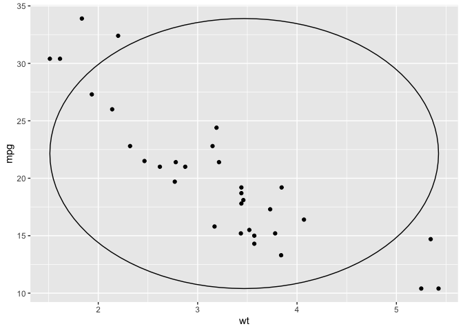
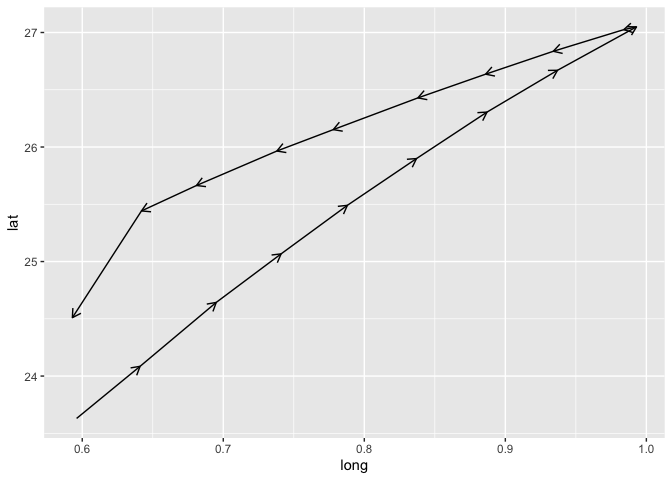
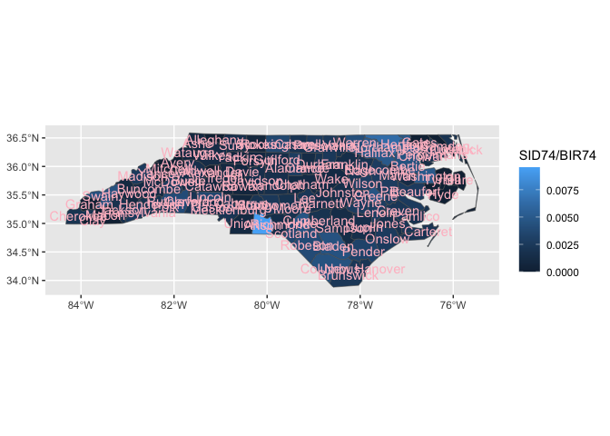
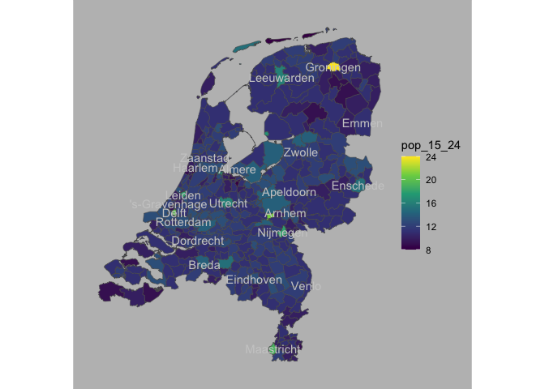

Proposing the {ggtemp} package\! 🦄
<!-- (typical package introduction write up; but actually aspirational) -->

The goal of {ggtemp} is to make writing some quick useful extension
functions succinct.

Right now, the amount of code required to write extensions is a bit of a
mouthful, and could feel prohibitive for day-to-day analysis.
Specifically, defining new geom\_\* and stat\_\* layers outside of the
context of a package, I believe, is not common, but could be quite
useful, ultimately making plot builds intiuitive and fun, and code more
readable. However the usual amount of code required to make define new
geom\_\* or stat\_\* functions, might feel like it ‘gunks up’ your
script currently.

With the {ggtemp} package, we’ll live in a different world (🦄 🦄 🦄) where
the task is a snap 🫰, and the readability of the in-script definition of
a geom\_\* or stat\_\* function is quite succinct:

Proposed API where we create a new geom\_\* layer function

    library(ggtemp)
    
    # 1. work out some compute
    compute_group_xmean <- function(data, scales){
      
      data |> # a dataframe with vars x, the required aesthetic
        summarize(x = mean(x)) |>
        mutate(xend = x) |>
        mutate(y = -Inf, yend = Inf)
    
    }
    
    # 2. create layer function based on compute geom_xmean)
    create_layer_temp(fun_name = "geom_xmean",
                      compute_group = compute_group_xmean,
                      required_aes = "x",
                      geom_defaut = "segment")
                      
                      
    # 3. Use temp layer!                   
    ggplot(data = cars) + 
      aes(x = speed, y = dist) + 
      geom_point() + 
      geom_xmean()

# Part I. Work out functionality ✅

## Intro Thoughts

What if you just want to define a basic computational engine (geom\_\*
or stat\_\* function) on the fly in a script. It seems like it requires
a good amount of code, but there are things that repeat. Below, we see
if we define a StatTemp within a function, and use that function to
remove some of the repetition for vanilla-y extensions.

TLDR: This seems to work, and surprisingly well (??). I thought I’d only
be able to use StatTemp once, but you seem to be able to define multiple
geoms\_\* functions with the same define\_temp\_geom wrapper…

## Status Quo: 1. compute, 2. ggproto, 3. define layer

``` r
library(tidyverse)
#> ── Attaching core tidyverse packages ─────────────────── tidyverse 2.0.0.9000 ──
#> ✔ dplyr     1.1.0          ✔ readr     2.1.4     
#> ✔ forcats   1.0.0          ✔ stringr   1.5.0     
#> ✔ ggplot2   3.4.4.9000     ✔ tibble    3.2.1     
#> ✔ lubridate 1.9.2          ✔ tidyr     1.3.0     
#> ✔ purrr     1.0.1          
#> ── Conflicts ────────────────────────────────────────── tidyverse_conflicts() ──
#> ✖ dplyr::filter() masks stats::filter()
#> ✖ dplyr::lag()    masks stats::lag()
#> ℹ Use the conflicted package (<http://conflicted.r-lib.org/>) to force all conflicts to become errors
compute_panel_equilateral <- function(data, scales, n = 15){
  
  data |> 
    mutate(group = row_number()) |> 
    crossing(tibble(z = 0:n)) |>
    mutate(around = 2*pi*z/max(z)) |> 
    mutate(x = x0 + cos(around)*r,
           y = y0 + sin(around)*r) 
  
}

StatCircle <- ggproto(
  `_class` = "StatCircle",
  `_inherit` = ggplot2::Stat,
  compute_panel = compute_panel_equilateral,
  required_aes = c("x0", "y0", "r"))

geom_circle <- function(
  mapping = NULL,
  data = NULL,
  position = "identity",
  na.rm = FALSE,
  show.legend = NA,
  inherit.aes = TRUE, ...) {
  ggplot2::layer(
    stat = StatCircle,  # proto object from Step 2
    geom = ggplot2::GeomPolygon,  # inherit other behavior
    data = data,
    mapping = mapping,
    position = position,
    show.legend = show.legend,
    inherit.aes = inherit.aes,
    params = list(na.rm = na.rm, ...)
  )
}

data.frame(x0 = 0:1, y0 = 0:1, r = 1:2/3) |> 
  ggplot() + 
  aes(x0 = x0, y0 = y0, r = r) + 
  geom_circle() + 
  aes(fill = r)
```

<!-- -->

## Experimental: `define_layer_temp()` combines 2 and 3 in using a temp Stat under the hood

``` r
define_layer_temp <- function(
  default_aes = ggplot2::aes(),
  required_aes = character(),
  dropped_aes = character(), 
  optional_aes = character(),
  non_missing_aes = character(),
  compute_group = NULL,
  compute_panel = NULL, 
  compute_layer = NULL,
  # finish_layer = # we'll work on making these stat ggproto slots accessible too
  # retransform
  # extra_params =
  # setup_params
  # parameters
  geom = NULL,
  geom_default = ggplot2::GeomPoint, 
  mapping = NULL,
  data = NULL,
  position = "identity",
  na.rm = FALSE,
  show.legend = NA,
  inherit.aes = TRUE, 
  
  ...) {

StatTemp <- ggproto(
  `_class` = "StatTemp",
  `_inherit` = ggplot2::Stat,
  default_aes = default_aes,
  required_aes = required_aes)

if(!is.null(compute_group)){StatTemp$compute_group <- compute_group}
if(!is.null(compute_panel)){StatTemp$compute_panel <- compute_panel}
if(!is.null(compute_layer)){StatTemp$compute_layer <- compute_layer}

  if(is.null(geom)){geom <- geom_default}

  ggplot2::layer(
    stat = StatTemp, 
    geom = geom, 
    data = data,
    mapping = mapping,
    position = position,
    show.legend = show.legend,
    inherit.aes = inherit.aes,
    params = list(na.rm = na.rm, ...)
  )
}
```

### Try it out

#### abbreviated definition `geom_circle()` using `define_layer_temp`

``` r
compute_panel_circle <- function(data, scales, n = 15){
  
  data |> 
    mutate(group = row_number()) |> 
    crossing(tibble(z = 0:n)) |>
    mutate(around = 2*pi*z/max(z)) |> 
    mutate(x = x0 + cos(around)*r,
           y = y0 + sin(around)*r) 
  
}

geom_circle <- function(...){
  
  define_layer_temp(
    required_aes = c("x0", "y0", "r"),
    compute_panel = compute_panel_circle,
    geom_default = ggplot2::GeomPath,
    ...)
  
}
```

#### use `geom_circle()`

We see that the layers that are created can always have there geom
switched (provided that required aes are computed in the background).

``` r
library(ggplot2)
data.frame(x0 = 0:1, y0 = 0:1, r = 1:2/3) |>
  ggplot() +
  aes(x0 = x0, y0 = y0, r = r) +
  geom_circle() +
  aes(fill = r)
```

<!-- -->

``` r

last_plot() + 
  geom_circle(geom = "point")
```

<!-- -->

### Can you define a second w/ the same StatTemp…

#### define geom\_heart

``` r
compute_panel_heart <- function(data, scales){

  data %>%
  mutate(group = row_number()) %>%
  tidyr::crossing(around = 0:15/15) %>%
    dplyr::mutate(
      y = y0 + r * (
        .85 * cos(2*pi*around)
        - .35 * cos(2 * 2*pi*around)
        - .25 * cos(3 * 2*pi*around)
        - .05 * cos(4 * 2*pi*around)
      ),
      x = x0 + r * (sin(2*pi*around)^3))

}

geom_heart <- function(...){

    define_layer_temp(
      required_aes = c("x0", "y0", "r"),
      compute_panel = compute_panel_heart,
      geom_default =ggplot2::GeomPolygon,
      ...)

  }
```

#### try using both geom\_heart and geom\_circle together…

``` r
data.frame(x0 = 0:1, y0 = 0:1, r = 1:2/3) |>
  ggplot() +
  aes(x0 = x0, y0 = y0, r = r) +
  geom_heart(alpha = .3) +
  geom_circle(color = "red", 
              data = data.frame(x0 = 4,y0 = 2, r = 1)) + 
  annotate(geom = "point", x = .5, y = .5, size = 8, color = "green")
```

<!-- -->

## And `create_layer_temp` method, even more experimental (but feeling nicer to use)

### First just checking out how assign works.

``` r
assign(x = "geom_circle", 
       value = 
  
  function(...){
  
  define_layer_temp(
    required_aes = c("x0", "y0", "r"),
    compute_panel = compute_panel_circle,
    geom_default =ggplot2::GeomPath,
    ...)
  
}
)
```

### wrapping this…

``` r
create_layer_temp <- function(fun_name ="geom_circle", 
                              compute_panel = NULL,
                              compute_group = NULL,
                              required_aes = character(),
                              default_aes = aes(),
                              geom_default ="point", ...){

  assign(x = fun_name, 
         value = function(...){
           
  define_layer_temp(
    required_aes = required_aes,
    default_aes = default_aes, 
    compute_panel = compute_panel,
    compute_group = compute_group,
    geom_default = geom_default,
    ...)  },
  pos = 1
  )
  
}
```

#### and trying it out

``` r
create_layer_temp(fun_name = "stat_circle",
                  required_aes = c("x0", "y0", "r"),
                  compute_panel = compute_panel_circle,
                  geom_default ="polygon")


library(ggplot2)
ggplot(cars) + 
  aes(x0 = speed, y0 =  dist, r = 3) + 
  stat_circle(alpha = .4) + 
  coord_equal()
```

<!-- -->

## Let’s do star example\!

``` r
compute_panel_star <- function(data, scales, n_points = 5, prop_inner_r){

  n_vertices <- n_points * 2
  
  data %>%
  mutate(group = row_number()) %>%
  tidyr::crossing(around = 2*pi*0:(n_vertices)/(n_vertices)+pi/2) %>%
    dplyr::mutate(
      y = y + (r - r*c(rep(c(0,.35), 5), 0)
                ) * sin(around) ,
      x = x + (r - r*c(rep(c(0,.35), 5), 0)
                ) * cos(around)
      ) 

}

create_layer_temp(fun_name = "geom_star", 
                  compute_panel = compute_panel_star,
                  required_aes = c("x", "y", "r"),
                  geom_default ="polygon")


library(ggplot2)
ggplot(cars[1:8,] ) + 
  aes(x = speed, y =  dist, r = 1) + 
  geom_star() + 
  coord_equal()
```

<!-- -->

``` r

last_plot() + 
  geom_star(geom = "point", color = "magenta")
```

<!-- -->

### A point with no required aes

``` r
compute_group_point <- function(data, scales){
  
  if(is.null(data$y)){data$y <- 0}
  if(is.null(data$x)){data$x <- 0}
  
  data 
  
} 

cars |>
 select(x = speed, y = dist) |>
  compute_group_point()
#>     x   y
#> 1   4   2
#> 2   4  10
#> 3   7   4
#> 4   7  22
#> 5   8  16
#> 6   9  10
#> 7  10  18
#> 8  10  26
#> 9  10  34
#> 10 11  17
#> 11 11  28
#> 12 12  14
#> 13 12  20
#> 14 12  24
#> 15 12  28
#> 16 13  26
#> 17 13  34
#> 18 13  34
#> 19 13  46
#> 20 14  26
#> 21 14  36
#> 22 14  60
#> 23 14  80
#> 24 15  20
#> 25 15  26
#> 26 15  54
#> 27 16  32
#> 28 16  40
#> 29 17  32
#> 30 17  40
#> 31 17  50
#> 32 18  42
#> 33 18  56
#> 34 18  76
#> 35 18  84
#> 36 19  36
#> 37 19  46
#> 38 19  68
#> 39 20  32
#> 40 20  48
#> 41 20  52
#> 42 20  56
#> 43 20  64
#> 44 22  66
#> 45 23  54
#> 46 24  70
#> 47 24  92
#> 48 24  93
#> 49 24 120
#> 50 25  85


create_layer_temp(fun_name = "geom_point2",
                           compute_group = compute_group_point,
                           required_aes = character(),
                           default_aes = aes(x = NULL, y = NULL),
                           geom_default = "point")


ggplot(cars) + 
  geom_point2(alpha = .7)
```

<!-- -->

``` r

last_plot() +
  aes(x = speed) 
```

<!-- -->

``` r

last_plot() + 
  aes(y = dist)
```

<!-- -->

``` r

last_plot() + 
  aes(x = "all")
```

<!-- -->

### a cute musical example…

``` r
twinkle_little_star_drm <- "ddsslls ffmmrrd"
twinkle_lyrics <- "Twin-kle twin-kle lit-tle star
How I won-der what you are"


twinkle_little_star_drm |>
ggdoremi:::join_phrases_drm_lyrics(twinkle_lyrics) |>
 ggplot() + 
   aes(y = drm, x = id_in_phrase, r = .58, label = lyric) + 
   facet_wrap(~id_phrase) + 
  geom_star(alpha = .4) +
  geom_text(size = 5) +
  coord_equal() + 
  aes(fill = doremi, color = doremi)
#> Joining with `by = join_by(drm)`
#> Joining with `by = join_by(id_phrase, id_in_phrase)`
```

<!-- -->

``` r

last_plot()$data |> head()
#> # A tibble: 6 × 7
#> # Groups:   id_phrase [1]
#>   id_phrase id_in_phrase drm   doremi  freq lyric .group
#>       <int>        <int> <fct> <fct>  <dbl> <chr>  <int>
#> 1         1            1 d     do      440  Twin       1
#> 2         1            2 d     do      440  kle        1
#> 3         1            3 s     sol     660  twin       1
#> 4         1            4 s     sol     660  kle        1
#> 5         1            5 l     la      742. lit        1
#> 6         1            6 l     la      742. tle        1
```

``` r
compute_panel_heart <- function(data, scales){

  data %>%
  mutate(group = row_number()) %>%
  tidyr::crossing(around = 0:30/30) %>%
    dplyr::mutate(
      y = y + r*.8 * (
        .85 * cos(2*pi*around)
        - .3 * cos(2 * 2*pi*around)
        - .2 * cos(3 * 2*pi*around)
        - .05 * cos(4 * 2*pi*around)
      ),
      x = x + r * (sin(2*pi*around)^3))

}


create_layer_temp(fun_name = "geom_heart", 
                  compute_panel = compute_panel_heart,
                  required_aes = c("x", "y", "r"),
                  geom_default ="polygon")

alphabet_drm <- "ddsslls ffmmrrrrd ssfmmr sfmmr ddsslls ffmmrrd"
alphabet_lyrics <- 
"A B C D E F G
H I J K L M N O P
Q R S T U V
W X Y & Z
Val-en-tine's Day A B C's
A few hearts for you from me!"


alphabet_drm |>
  ggdoremi:::join_phrases_drm_lyrics(alphabet_lyrics) |>
 ggplot() + 
   aes(y = as.numeric(drm), x = id_in_phrase, r = .58, label = lyric) + 
   facet_wrap(~id_phrase, scales = "free_x") + 
  geom_hline(yintercept = c(8,10,12), color = "grey") + 
  geom_line(color = "black", linetype = "dashed") +
  geom_heart(fill = "white", color = "black", alpha = 1) +
  geom_text(size = 3, nudge_y = -.05, aes(alpha = nchar(lyric) > 1 | lyric %in% letters[1:4] | lyric == "&" |lyric %in% LETTERS[1:4]), show.legend = F) +
  # coord_equal() + 
  # aes(fill = doremi, color = doremi) +
  ggstamp::theme_void_fill("white") +
  theme(text = element_text(color = "white")) + 
  theme(panel.spacing.x = unit(0, "in"))
#> Joining with `by = join_by(drm)`
#> Joining with `by = join_by(id_phrase, id_in_phrase)`
#> Warning: Using alpha for a discrete variable is not advised.
```

<!-- -->

# geom\_xmean on the fly with compute group…

``` r
# 1. write some compute
compute_group_xmean <- function(data, scales){
  
  data |> 
    summarize(x = mean(x)) |>
    mutate(xend = x) |>
    mutate(y = -Inf, yend = Inf)

}

# 2. define function
create_layer_temp(fun_name = "geom_xmean",
                  compute_group = compute_group_xmean,
                  required_aes = "x",
                  geom_default ="segment")

# 3. use function
ggplot(cars) + 
  aes(x = speed, y = dist) + 
  geom_point() + 
  geom_xmean() + 
  aes(color = speed > 18)
```

<!-- -->

## compute\_oval\_minmax

``` r
compute_oval_minmax <- function(data, scales, n = 100){
  
  data |> 
    summarize(
        x0 = sum(range(x))/2,
        y0 = sum(range(y))/2,
        rx = (range(x)[2] - range(x)[1])/2 ,
        ry = (range(y)[2] - range(y)[1])/2) |>
    # mutate(group = row_number()) |> 
    crossing(tibble(z = 0:n)) |>
    mutate(around = 2*pi*z/max(z)) |> 
    mutate(x = x0 + cos(around)*rx,
           y = y0 + sin(around)*ry) 
  
}

mtcars |>
  select(x = wt, y = mpg) |>
  compute_oval_minmax()
#> # A tibble: 101 × 8
#>       x0    y0    rx    ry     z around     x     y
#>    <dbl> <dbl> <dbl> <dbl> <int>  <dbl> <dbl> <dbl>
#>  1  3.47  22.2  1.96  11.8     0 0       5.42  22.2
#>  2  3.47  22.2  1.96  11.8     1 0.0628  5.42  22.9
#>  3  3.47  22.2  1.96  11.8     2 0.126   5.41  23.6
#>  4  3.47  22.2  1.96  11.8     3 0.188   5.39  24.4
#>  5  3.47  22.2  1.96  11.8     4 0.251   5.36  25.1
#>  6  3.47  22.2  1.96  11.8     5 0.314   5.33  25.8
#>  7  3.47  22.2  1.96  11.8     6 0.377   5.29  26.5
#>  8  3.47  22.2  1.96  11.8     7 0.440   5.24  27.2
#>  9  3.47  22.2  1.96  11.8     8 0.503   5.18  27.8
#> 10  3.47  22.2  1.96  11.8     9 0.565   5.12  28.4
#> # ℹ 91 more rows

# 2. define function
create_layer_temp(fun_name = "geom_oval_xy_range",
                  compute_group = compute_oval_minmax,
                  required_aes = c("x","y"),
                  geom_default = "path")


ggplot(mtcars) + 
  aes(x = wt, y = mpg) +
  geom_point() +
  geom_oval_xy_range()
```

<!-- -->

``` r

last_plot() + 
   aes(color = wt > 3.4)
```

<!-- -->

<!-- # Dates extension example - geom progression -->

``` r


compute_group_progression <- function(data, scales){
  
  data |>
    mutate(xend = lead(x)) |>
    mutate(yend = lead(y)) 
  
}


create_layer_temp(fun_name = "stat_progression",
                  compute_group = compute_group_progression,
                  required_aes = c("x","y"),
                  geom_default = "segment")


geom_progression <- function(...){
  
  stat_progression(arrow = arrow(ends = "last", length = unit(.1, "in")),...)
  
}


tibble::tribble(~event, ~date,
                "Announcement", 0,
                "deadline", 3,
                "extended\ndeadline", 5) |>
  ggplot() + 
  aes(x = date, y = "Conf") + 
  geom_progression() + 
  geom_point() +
  geom_text(aes(label = event), vjust = 0)
#> Warning: Removed 1 row containing missing values or values outside the scale range
#> (`geom_segment()`).
```

<!-- -->

``` r


# And w/ stackoverflow example.
# https://stackoverflow.com/questions/70249589/how-to-add-multiple-arrows-to-a-path-according-to-line-direction-using-ggplot2
data.frame(long =  c(0.596, 0.641, 0.695, 0.741, 0.788, 0.837,
       0.887, 0.937, 0.993, 0.984, 0.934, 0.886,
       0.838, 0.778, 0.738, 0.681, 0.642, 0.593),
       lat = c(23.630, 24.085, 24.643, 25.067, 25.491, 25.899,
       26.305, 26.670, 27.049, 27.025, 26.836, 26.636,
       26.429, 26.152, 25.965, 25.664, 25.442, 24.510)) %>% 
  ggplot() + 
  aes(x = long, y = lat) + 
  geom_progression()
#> Warning: Removed 1 row containing missing values or values outside the scale range
#> (`geom_segment()`).
```

<!-- -->

# in 100

``` r
tibble(outcome = sample(0:1, 1000, replace = T)) |>
  count(outcome) |>
  mutate(percent = round(100*n/sum(n))) |>
  uncount(percent) |>
  mutate(id = row_number()-1) |>
  ggplot() + 
  aes(x = id %% 10, y = id %/% 10) +
  geom_tile() + 
  aes(fill = outcome)
```

<!-- -->

``` r


compute_panel_100 <- function(data, scales){
  
  data  |>
  count(outcome) |>
  mutate(percent = round(100*n/sum(n))) |>
  uncount(percent) |>
  mutate(id = row_number()-1) |>
  mutate(x = id %% 10) |>
  mutate(y = id %/% 10) |>
  mutate(width = .7, height = .7)
  
  
}

create_layer_temp(fun_name = "geom_100",
                  compute_panel = compute_panel_100,
                  required_aes = c("outcome"),
                  geom_default = "tile")


Titanic %>% 
  as.data.frame() %>% 
  uncount(Freq) |>
  ggplot() + 
  aes(outcome = Survived) + 
  geom_100() + 
  geom_100(geom = "text", 
           mapping = aes(label = after_stat(outcome)))
```

<!-- -->

``` r

last_plot() +
  aes(fill = after_stat(outcome)) +
  labs(fill = "Survived")
```

<!-- -->

``` r


last_plot() + 
  facet_wrap(~Sex)
```

<!-- -->

``` r

last_plot() + 
  facet_grid(Sex ~ Age) 
```

<!-- -->

``` r

# fails, no propagation of alpha var...
last_plot() + 
  aes(alpha = Age)
#> Warning: Using alpha for a discrete variable is not advised.
```

<!-- -->

``` r

# Look at https://liamgilbey.github.io/ggwaffle/
```

### some more things to try

  - Diverging bar chart…
  - date input to month layout

# spatial ‘status quo’ of ggplot2 extension cookbook

``` r
northcarolina_county_reference0 <-
  sf::st_read(system.file("shape/nc.shp", package="sf")) |>
  dplyr::rename(county_name = NAME,
                fips = FIPS) |>
  dplyr::select(county_name, fips, geometry)
#> Reading layer `nc' from data source 
#>   `/Library/Frameworks/R.framework/Versions/4.2/Resources/library/sf/shape/nc.shp' 
#>   using driver `ESRI Shapefile'
#> Simple feature collection with 100 features and 14 fields
#> Geometry type: MULTIPOLYGON
#> Dimension:     XY
#> Bounding box:  xmin: -84.32385 ymin: 33.88199 xmax: -75.45698 ymax: 36.58965
#> Geodetic CRS:  NAD27

return_st_bbox_df <- function(sf_df){
  
  bb <- sf::st_bbox(sf_df)

  data.frame(xmin = bb[1], ymin = bb[2],
             xmax = bb[3], ymax = bb[4])

}

add_xy_coords <- function(geo_df){

geo_df |>
    dplyr::pull(geometry) |>
    sf::st_zm() |>
    sf::st_point_on_surface() ->
  points_sf

the_coords <- do.call(rbind, sf::st_geometry(points_sf)) %>%
  tibble::as_tibble() %>% setNames(c("x","y"))

cbind(geo_df, the_coords)

}

northcarolina_county_reference <- northcarolina_county_reference0 |>
  dplyr::mutate(bb =
                  purrr::map(geometry,
                             return_st_bbox_df)) |>
  tidyr::unnest(bb) |>
  data.frame() |>
  add_xy_coords() 
#> Warning in st_point_on_surface.sfc(sf::st_zm(dplyr::pull(geo_df, geometry))):
#> st_point_on_surface may not give correct results for longitude/latitude data
#> Warning: The `x` argument of `as_tibble.matrix()` must have unique column names if
#> `.name_repair` is omitted as of tibble 2.0.0.
#> ℹ Using compatibility `.name_repair`.
#> This warning is displayed once every 8 hours.
#> Call `lifecycle::last_lifecycle_warnings()` to see where this warning was
#> generated.

compute_panel_county <- function(data, scales){
  
  data |> 
    dplyr::inner_join(northcarolina_county_reference)
  
}

StatNcfips <- ggplot2::ggproto(`_class` = "StatNcfips",
                                `_inherit` = ggplot2::Stat,
                                required_aes = "fips|county_name",
                                compute_panel = compute_panel_county)


stat_county <- function(
      mapping = NULL,
      data = NULL,
      geom = ggplot2::GeomSf,
      position = "identity",
      na.rm = FALSE,
      show.legend = NA,
      inherit.aes = TRUE,
      crs = "NAD27", # "NAD27", 5070, "WGS84", "NAD83", 4326 , 3857
      ...) {

  c(ggplot2::layer_sf(
              stat = StatNcfips,  # proto object from step 2
              geom = geom,  # inherit other behavior
              data = data,
              mapping = mapping,
              position = position,
              show.legend = show.legend,
              inherit.aes = inherit.aes,
              params = rlang::list2(na.rm = na.rm, ...)
              ),
              
              coord_sf(crs = crs,
                       default_crs = sf::st_crs(crs),
                       datum = crs,
                       default = TRUE)
     )
  }


ggnorthcarolina::northcarolina_county_flat |> 
  ggplot() + 
  aes(fips = fips) + 
  stat_county(crs = "NAD83")  + 
  aes(fill = SID74/BIR74) + 
  stat_county(geom = 'text', 
              aes(label = SID74),
              color = "oldlace")
#> Joining with `by = join_by(fips)`
#> Joining with `by = join_by(fips)`
```

<!-- -->

# define\_layer\_sf\_temp build

``` r
northcarolina_county_reference0 <-
  sf::st_read(system.file("shape/nc.shp", package="sf")) |>
  dplyr::rename(county_name = NAME,
                fips = FIPS) |>
  dplyr::select(county_name, fips, geometry)
#> Reading layer `nc' from data source 
#>   `/Library/Frameworks/R.framework/Versions/4.2/Resources/library/sf/shape/nc.shp' 
#>   using driver `ESRI Shapefile'
#> Simple feature collection with 100 features and 14 fields
#> Geometry type: MULTIPOLYGON
#> Dimension:     XY
#> Bounding box:  xmin: -84.32385 ymin: 33.88199 xmax: -75.45698 ymax: 36.58965
#> Geodetic CRS:  NAD27
```

``` r
return_st_bbox_df <- function(sf_df){
  
  bb <- sf::st_bbox(sf_df)

  data.frame(xmin = bb[1], ymin = bb[2],
             xmax = bb[3], ymax = bb[4])

}

add_xy_coords <- function(geo_df){

geo_df |>
    dplyr::pull(geometry) |>
    sf::st_zm() |>
    sf::st_point_on_surface() ->
  points_sf

the_coords <- do.call(rbind, sf::st_geometry(points_sf)) %>%
  tibble::as_tibble() %>% setNames(c("x","y"))

cbind(geo_df, the_coords)

}

define_layer_sf_temp <- function(ref_df,
                                 geom = NULL, 
                                 geom_default = ggplot2::GeomSf, 
                                 required_aes, 
                                 default_aes = ggplot2::aes(),
                                 stamp = FALSE,
                                 mapping = NULL,
                                 data = NULL,
                                 position = "identity",
                                 na.rm = FALSE,
                                 show.legend = NA,
                                 inherit.aes = TRUE, 
                                 crs = sf::st_crs(ref_df),
                                 ...){


ref_df_w_bb_and_xy_centers <- 
  ref_df |>
  dplyr::mutate(bb =
                  purrr::map(geometry,
                             return_st_bbox_df)) |>
  tidyr::unnest(bb) |>
  data.frame() |>
  add_xy_coords()

  ref_df_w_bb_and_xy_centers$id_col <- ref_df_w_bb_and_xy_centers[,1]


compute_panel_geo <- function(data, scales, keep = NULL, drop = c()){
  
  if(!stamp){
  
  out <- data |> 
    dplyr::inner_join(ref_df_w_bb_and_xy_centers) |>
    filter(!(id_col %in% drop))

  
  }
  
  if(stamp){
  
  out <- ref_df_w_bb_and_xy_centers |>
    filter(!(id_col %in% drop))
    
  }
  
  out
  
}


StatTempsf <- ggplot2::ggproto(`_class` = "StatTempsf",
                                `_inherit` = ggplot2::Stat,
                                required_aes = required_aes,
                                compute_panel = compute_panel_geo,
                               default_aes = default_aes)

  if(is.null(geom)){geom <- geom_default}

 c(ggplot2::layer_sf(
              stat = StatTempsf,  # proto object from step 2
              geom = geom,  # inherit other behavior
              data = data,
              mapping = mapping,
              position = position,
              show.legend = show.legend,
              inherit.aes = inherit.aes,
              params = rlang::list2(na.rm = na.rm, ...)
              ),
              
              coord_sf(crs = crs,
                       default_crs = sf::st_crs(crs),
                       datum = crs,
                       default = TRUE)
     )
}
```

### Try it out

``` r
 sf::st_read(system.file("shape/nc.shp", package="sf")) |>
  dplyr::rename(county_name = NAME,
                fips = FIPS) |>
  dplyr::select(county_name, fips, geometry) ->
nc_reference
#> Reading layer `nc' from data source 
#>   `/Library/Frameworks/R.framework/Versions/4.2/Resources/library/sf/shape/nc.shp' 
#>   using driver `ESRI Shapefile'
#> Simple feature collection with 100 features and 14 fields
#> Geometry type: MULTIPOLYGON
#> Dimension:     XY
#> Bounding box:  xmin: -84.32385 ymin: 33.88199 xmax: -75.45698 ymax: 36.58965
#> Geodetic CRS:  NAD27

geom_county2 <- function(...){
  
  define_layer_sf_temp(ref_df = nc_reference,
                         required_aes = "fips|county_name",
                       default_aes = aes(label = after_stat(county_name)),
                       ...)
  
}

ggnorthcarolina::northcarolina_county_flat |> 
  ggplot() + 
  aes(fips = fips) + 
  geom_county2()  + 
  aes(fill = SID74/BIR74)  +
  geom_county2(geom = "text",
               color = "pink")
#> Warning in st_point_on_surface.sfc(sf::st_zm(dplyr::pull(geo_df, geometry))):
#> st_point_on_surface may not give correct results for longitude/latitude data

#> Warning in st_point_on_surface.sfc(sf::st_zm(dplyr::pull(geo_df, geometry))):
#> st_point_on_surface may not give correct results for longitude/latitude data
#> Joining with `by = join_by(fips)`
#> Joining with `by = join_by(fips)`
```

<!-- -->

``` r
  
last_plot() + 
  aes(label = BIR74)
#> Joining with `by = join_by(fips)`
#> Joining with `by = join_by(fips)`
```

<!-- -->

``` r


last_plot() +
  geom_county2(geom = "text", 
              mapping = aes(label = BIR74))  #oh! 
#> Warning in st_point_on_surface.sfc(sf::st_zm(dplyr::pull(geo_df, geometry))):
#> st_point_on_surface may not give correct results for longitude/latitude data
#> Joining with `by = join_by(fips)`
#> Joining with `by = join_by(fips)`
#> Joining with `by = join_by(fips)`
```

<!-- -->

``` r
create_layer_sf_temp <- function(ref_df, 
                                 fun_name ="geom_my_sf", 
                                 required_aes, 
                                 default_aes = ggplot2::aes(),
                                 geom_default = ggplot2::GeomSf,
                                 ...){

  assign(x = fun_name, 
         value = function(...){
           
           
  define_layer_sf_temp(ref_df = ref_df,
    required_aes = required_aes,
    geom_default = geom_default,
    default_aes = default_aes,
    ...)  },
  pos = 1
  )
  
}
```

``` r
sf::st_read(system.file("shape/nc.shp", package="sf")) |>
  dplyr::rename(county_name = NAME,
                fips = FIPS) |>
  dplyr::select(county_name, fips, geometry) ->
my_ref_data
#> Reading layer `nc' from data source 
#>   `/Library/Frameworks/R.framework/Versions/4.2/Resources/library/sf/shape/nc.shp' 
#>   using driver `ESRI Shapefile'
#> Simple feature collection with 100 features and 14 fields
#> Geometry type: MULTIPOLYGON
#> Dimension:     XY
#> Bounding box:  xmin: -84.32385 ymin: 33.88199 xmax: -75.45698 ymax: 36.58965
#> Geodetic CRS:  NAD27


create_layer_sf_temp(ref_df = my_ref_data,
  fun_name = "geom_county",
  required_aes = "county_name|fips",
  default_aes = ggplot2::aes(label = after_stat(county_name)))


ggnorthcarolina::northcarolina_county_flat |> 
  ggplot() + 
  aes(fips = fips) + 
  geom_county()  + 
  aes(fill = SID74/BIR74) + 
  geom_county(geom = "text", 
              mapping = aes(label = BIR74)) # oh ho!!
#> Warning in st_point_on_surface.sfc(sf::st_zm(dplyr::pull(geo_df, geometry))):
#> st_point_on_surface may not give correct results for longitude/latitude data

#> Warning in st_point_on_surface.sfc(sf::st_zm(dplyr::pull(geo_df, geometry))):
#> st_point_on_surface may not give correct results for longitude/latitude data
#> Joining with `by = join_by(fips)`
#> Joining with `by = join_by(fips)`
```

<!-- -->

``` r

ggnorthcarolina::northcarolina_county_flat |> 
  ggplot() + 
  aes(fips = fips) + 
  geom_county()  + 
  aes(fill = SID74/BIR74) + 
  geom_county(geom = "text", color = "pink",
              check_overlap = T)
#> Warning in st_point_on_surface.sfc(sf::st_zm(dplyr::pull(geo_df, geometry))):
#> st_point_on_surface may not give correct results for longitude/latitude data

#> Warning in st_point_on_surface.sfc(sf::st_zm(dplyr::pull(geo_df, geometry))):
#> st_point_on_surface may not give correct results for longitude/latitude data
#> Joining with `by = join_by(fips)`
#> Joining with `by = join_by(fips)`
```

<!-- -->

``` r
library(tmap)
#> Breaking News: tmap 3.x is retiring. Please test v4, e.g. with
#> remotes::install_github('r-tmap/tmap')
data(NLD_prov)
data("NLD_muni")

# create geo reference data frame
NLD_prov |> 
  dplyr::select(prov_code = code, prov_name = name, geometry) ->
netherlands_prov_ref_geo


NLD_muni |> 
  dplyr::select(muni_code = code, muni_name = name, geometry) ->
netherlands_muni_ref_geo

# create new geom_* function
create_layer_sf_temp(ref_df = netherlands_prov_ref_geo,
  fun_name = "geom_nl_prov",
  required_aes = "prov_name|prov_code",
  default_aes = aes(label = after_stat(prov_name)))


create_layer_sf_temp(ref_df = netherlands_muni_ref_geo,
  fun_name = "geom_nl_muni",
  required_aes = "muni_name|muni_code",
  default_aes = aes(label = after_stat(muni_name)))


# Make a map
NLD_prov |> 
  sf::st_drop_geometry() |>
  ggplot() + 
  aes(prov_code = code) +
  geom_nl_prov() + 
  geom_nl_prov(geom = "text") + 
  aes(fill = pop_15_24) 
#> old-style crs object detected; please recreate object with a recent sf::st_crs()
#> old-style crs object detected; please recreate object with a recent sf::st_crs()
#> old-style crs object detected; please recreate object with a recent sf::st_crs()
#> old-style crs object detected; please recreate object with a recent sf::st_crs()
#> Joining with `by = join_by(prov_code)`
#> Joining with `by = join_by(prov_code)`
```

<!-- -->

``` r


NLD_muni |>
  sf::st_drop_geometry() |>
  ggplot() + 
  aes(muni_code = code) +
  geom_nl_muni() + 
  geom_nl_muni(geom = "text", 
               data = . %>% filter(population > 100000 ),
               check_overlap = T,
               color = "gray80",
               face = "bold") + 
  aes(fill = pop_15_24) + 
  scale_fill_viridis_c() + 
  ggstamp::theme_void_fill("grey")
#> old-style crs object detected; please recreate object with a recent sf::st_crs()
#> old-style crs object detected; please recreate object with a recent sf::st_crs()
#> old-style crs object detected; please recreate object with a recent sf::st_crs()
#> Warning in ggplot2::layer_sf(stat = StatTempsf, geom = geom, data = data, :
#> Ignoring unknown parameters: `face`
#> old-style crs object detected; please recreate object with a recent sf::st_crs()
#> Joining with `by = join_by(muni_code)`Joining with `by = join_by(muni_code)`
```

<!-- -->

<!-- # for brain example, stamp? -->

<!-- ```{r} -->

<!-- library(ggplot2) -->

<!-- ggseg::aseg$data |> -->

<!--   dplyr::filter(!is.na(label)) %>%  -->

<!--   rename(seg_id = label) -> -->

<!-- id_and_boundaries -->

<!-- ggseg::aseg$data |> -->

<!--   dplyr::filter(!is.na(label)) |> -->

<!--   sf::st_drop_geometry() -> -->

<!-- regions_flat -->

<!-- # th -->

<!-- id_and_boundaries |> -->

<!--    dplyr::left_join(regions_flat) |> -->

<!--    ggplot() + -->

<!--    geom_sf() +  -->

<!--    aes(fill = hemi) -->

<!-- create_layer_sf_temp(id_and_boundaries,  -->

<!--                      fun_name = "stamp_brain", -->

<!--                      default_aes = aes(label = after_stat(region)), -->

<!--                      required_aes = character() -->

<!--                      ) -->

<!-- library(ggplot2) -->

<!-- regions_flat %>% -->

<!--   ggplot() + -->

<!--   aes(seg_id = seg_id,  -->

<!--       fill = region == "amygdala") + -->

<!--   geom_brain()  -->

<!-- ``` -->

``` r
rnaturalearth::ne_countries(  
  scale = "medium", returnclass = "sf") %>%  
  select(name, continent, geometry, iso_a3) %>% 
  rename(country_name = name,
         iso3c = iso_a3
         )  ->
ref_data

create_layer_sf_temp(ref_df = ref_data, 
                     fun_name = "geom_country",
                    required_aes = "country_name|iso3c")


gapminder::gapminder |>
  filter(year == 2002) |>
  ggplot() + 
  aes(country_name = country) + 
  geom_country() + 
  geom_country(geom = "text", 
               mapping = aes(label = country),
               check_overlap =T)
#> Warning in st_point_on_surface.sfc(sf::st_zm(dplyr::pull(geo_df, geometry))):
#> st_point_on_surface may not give correct results for longitude/latitude data

#> Warning in st_point_on_surface.sfc(sf::st_zm(dplyr::pull(geo_df, geometry))):
#> st_point_on_surface may not give correct results for longitude/latitude data
#> Joining with `by = join_by(country_name)`
#> Joining with `by = join_by(country_name)`
```

<!-- -->

``` r

library(tidyverse)
heritage_wide <- readr::read_csv('https://raw.githubusercontent.com/rfordatascience/tidytuesday/master/data/2024/2024-02-06/heritage.csv') 
#> Rows: 3 Columns: 3
#> ── Column specification ────────────────────────────────────────────────────────
#> Delimiter: ","
#> chr (1): country
#> dbl (2): 2004, 2022
#> 
#> ℹ Use `spec()` to retrieve the full column specification for this data.
#> ℹ Specify the column types or set `show_col_types = FALSE` to quiet this message.

heritage <- heritage_wide |>
  pivot_longer(-1, names_to = "year", values_to = "count") |>
  mutate(year = as.numeric(year)) |>
  mutate(country = as.factor(country))

heritage |>
  ggplot() + 
  aes(country_name = country) +
  geom_country() +
  aes(fill = count) + 
  facet_grid(~year) + 
  geom_country(geom = "text", mapping = aes(label = paste(country, count, sep = "\n")))
#> Warning in st_point_on_surface.sfc(sf::st_zm(dplyr::pull(geo_df, geometry))):
#> st_point_on_surface may not give correct results for longitude/latitude data

#> Warning in st_point_on_surface.sfc(sf::st_zm(dplyr::pull(geo_df, geometry))):
#> st_point_on_surface may not give correct results for longitude/latitude data
#> Joining with `by = join_by(country_name)`
#> Joining with `by = join_by(country_name)`
#> Joining with `by = join_by(country_name)`
#> Joining with `by = join_by(country_name)`
```

<!-- -->

# Part II. Packaging and documentation 🚧 ✅

## Phase 1. Minimal working package

  - Bit A. Created files for package archetecture, running
    `devtools::create(".")` in interactive session. ✅
  - Bit B. Added roxygen skeleton? 🚧
  - Bit C. Managed dependencies ? 🚧

<!-- end list -->

``` r
usethis::use_package("ggplot2")
```

  - Bit D. Moved functions R folder? ✅

<!-- end list -->

``` r
readme2pkg::chunk_to_r("define_layer_temp")
readme2pkg::chunk_to_r("create_layer_temp")
readme2pkg::chunk_to_r("define_layer_sf_temp")
readme2pkg::chunk_to_r("create_layer_sf_temp")
```

  - Run `devtools::check()` and addressed errors. 🚧

<!-- end list -->

``` r
devtools::check(pkg = ".")
```

  - ✅

<!-- end list -->

``` r
devtools::build()
```

  - Bit G. Write and test traditional README that uses built package. 🚧
    ✅

Install package with:

    remotes::installgithub("EvaMaeRey/readme2pkg.template")

Then…

``` r
library(ggtemp)  ##<< change to your package name here

compute_panel_circle <- function(data, scales, n = 15){
  
  data |> 
    mutate(group = row_number()) |> 
    crossing(tibble(z = 0:n)) |>
    mutate(around = 2*pi*z/max(z)) |> 
    mutate(x = x0 + cos(around)*r,
           y = y0 + sin(around)*r) 
  
}

geom_circle_points <- function(...){
  
  ggtemp:::define_layer_temp(
    required_aes = c("x0", "y0", "r"),
    compute_panel = compute_panel_circle,
    geom_default =ggplot2::GeomPoint,
    ...)
  
}


library(ggplot2)
ggplot(cars) +
  aes(x0 = speed, y0 = dist, r = 1) + 
  geom_circle_points()
```

<!-- -->

  - Bit H. Chosen a license? 🚧 ✅

<!-- end list -->

``` r
usethis::use_mit_license()
#> ✔ Setting active project to '/Users/evangelinereynolds/Google
#> Drive/r_packages/ggtemp'
```

  - Bit I. Add lifecycle badge (experimental)

<!-- end list -->

``` r
usethis::use_lifecycle_badge("experimental")
#> • Copy and paste the following lines into 'README.Rmd':
#>   <!-- badges: start -->
#>   [](https://lifecycle.r-lib.org/articles/stages.html#experimental)
#>   <!-- badges: end -->
```

## Phase 2: Listen & iterate 🚧 ✅

Try to get feedback from experts on API, implementation, default
decisions. Is there already work that solves this problem?

## Phase 3: Let things settle

### Bit A. Settle on examples. Put them in the roxygen skeleton and readme. 🚧 ✅

### Bit B. Written formal tests of functions and save to test that folders 🚧 ✅

That would look like this…

``` r
library(testthat)

test_that("calc times 2 works", {
  expect_equal(times_two(4), 8)
  expect_equal(times_two(5), 10)
  
})
```

``` r
readme2pkg::chunk_to_tests_testthat("test_calc_times_two_works")
```

### Bit C. Added a description and author information in the DESCRIPTION file 🚧 ✅

### Bit D. Addressed *all* notes, warnings and errors. 🚧 ✅

## Phase 4. Promote to wider audience…

### Bit A. Package website built? 🚧 ✅

### Bit B. Package website deployed? 🚧 ✅

## Phase 5: Harden/commit

### Submit to CRAN? 🚧 ✅

# Appendix: Reports, Environment

## Description file extract

``` r
# readlines(Description)
```

## Environment

Here I just want to print the packages and the versions

``` r
all <- sessionInfo() |> print() |> capture.output()
all[11:17]
#> [1] ""                                                                         
#> [2] "attached base packages:"                                                  
#> [3] "[1] stats     graphics  grDevices utils     datasets  methods   base     "
#> [4] ""                                                                         
#> [5] "other attached packages:"                                                 
#> [6] " [1] ggtemp_0.0.0.9000    tmap_3.3-4           lubridate_1.9.2     "      
#> [7] " [4] forcats_1.0.0        stringr_1.5.0        dplyr_1.1.0         "
```

## `devtools::check()` report

``` r
devtools::check(pkg = ".")
#> ℹ Updating ggtemp documentation
#> ℹ Loading ggtemp
#> Error: R CMD check found WARNINGs
```

## Non-developer introduction to package (and test of installed package)

The goal of the {xxx} package

To install the dev version use the following:

    remotes::install_github("owner/repo") # 

## Example using package

``` r
library(mypackage)
myfunction(mtcars)
```
